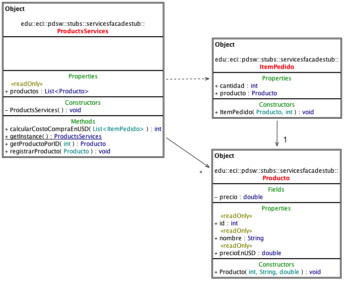

# Primefaces-ShoppingKart-base

### Parte II

Ahora, va a realizar un primer prototipo de un ‘carrito de compras’. Para esto, clone el proyecto
disponible en https://github.com/PDSW-ECI/Primefaces-ShoppingKart-base.git.

El proyecto incluye la dependencia:

```xml
 <groupId>org2.pdsw.stubs</groupId>
 <artifactId>ServicesFacadeStub</artifactId>
 <version>1.2</version>
```


La cual provee un API que permite consultar una base de datos de productos, e incluye
operaciones para calcular el costo total de un conjunto de ítems, donde cada ítem consta de un producto y una cantidad requerida de dicho producto. Por ser una dependencia Maven, usted no tiene acceso a sus fuentes, sin embargo, con el siguiente modelo se pueden indentificar las clases y métodos disponibles:



La aplicación ya tiene una página base (shoppingkart.xhtml), y una clase que podrá servir como
BackingBean (ShoppingKartBackingBean) la cual aún no tiene todas las anotaciones ni los métodos
requeridos. Se requiere que usted implemente la siguiente funcionalidad:

  1. La página debe mostrar en una tabla el listado de los productos disponibles.

  2. Se debe poder seleccionar un producto, y luego, en un campo adicional, indicar la cantidad que se quiere comprar del mismo. Al hacer clic en un botón de ‘agregar a carrito’, se debe hacer la operación respectiva: crear un ítem nuevo (producto y cantidad), y agregarlo una colección de dichos ítems que debería mantenerse en el backingbean.

  3. En la misma página, se debe mostrar otra tabla, en la que se muestre lo que se ha seleccionado hasta el momento.

  4. Se debe tener un botón ‘calcular costos’, el cual, a partir del ‘carrito de compras’ creado hasta el momento, determine (haciendo uso del API suministrado), y lo muestre en la pantalla.

      Para hacer esto revise:

      Sección 3.33 del manual de PrimeFaces, en especial la página 159 que se refiere a cómo capturar la selección de una tabla. http://www.primefaces.org/docs/guide/primefaces_user_guide_5_2.pdf

      Para que la tabla del listado de productos, y la tabla correspondiente al carrito de compras queden distribuidos de una forma organizada (y no uno debajo del otro), revise el uso de éste en la sección 3.64 del mismo manual, o a través de las demostraciones disponibles en: http://www.primefaces.org/showcase/ui/panel/layout/element.xhtml
